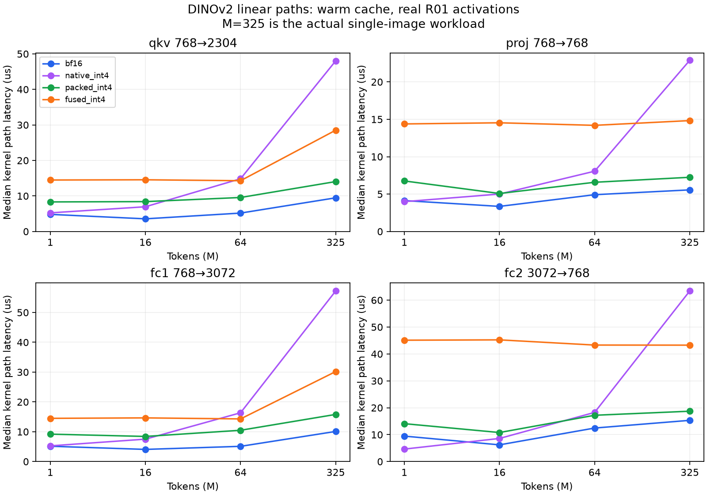

# 9-1 후속: INT4가 BF16보다 느린 원인 — 선형층·캐시·하드웨어 카운터

**이 구현의 실제325토큰 선형층에서는 INT4 복원 비용과 커널 효율 차이를 확인했습니다. 작은 모델에서 양자화는 무조건 무의미하다는 결론은 아닙니다.** 관리자 권한으로 Nsight Compute 카운터를 수집했으며, 드라이버 설정은 바꾸지 않았습니다.

## 실험 범위

- DINOv2 ViT-B/14 block0의 실제 qkv/proj/fc1/fc2 가중치. R01–R04 첫 정상train 프레임의 실제 활성값으로 수치검증, R01 입력으로 타이밍. seed0, BF16, TF32off. 전체 모델이나 테스트 AUROC 실험이 아닙니다.
- M=1,16,64,325. M325가 실제 이미지 조건이며 앞쪽 토큰만 취한 다른 M은 작업 크기 진단입니다. 4형상×4토큰수×6경로, 정상수치384개 검사 전부 통과. 동일 양자화 기준 raw linear relativeL2≤.01 및 cosine거리≤1e-3이며 최종 VAD 특징 기준과 구분합니다.
- warm: CUDA Graph32호출×7 round. eviction attempt: L2보다 큰256MiB GPU버퍼 zero 후 single-call graph21회. event 시간에서 flush 제외. 후보 순서는 seed0으로 섞었습니다. 타이밍과 Nsight 계측은 별도 수행했습니다.
- GPU L2 크기는 128MiB. 개별 선형층 가중치는 이보다 작습니다. hot-cache 반복과 전체 백본의 캐시 상태는 같지 않습니다.

## 실제 M325: 복원 비용 분리 (warm-cache, 중앙값 µs)

| 선형층 K→N | BF16 | 기존 native INT4 | 현재 packed INT4 | 복원만 | 복원된 가중치 GEMM만 | 새 융합 INT4 |
|---|---:|---:|---:|---:|---:|---:|
| qkv 768→2304 | 9.48 | 48.04 | 14.05 | 3.73 | 10.69 | 28.51 |
| proj 768→768 | 5.56 | 22.89 | 7.25 | 2.08 | 5.52 | 14.83 |
| fc1 768→3072 | 10.10 | 57.22 | 15.81 | 4.46 | 11.54 | 30.18 |
| fc2 3072→768 | 15.32 | 63.42 | 18.71 | 4.17 | 14.66 | 43.27 |

packed 경로에서 복원을 제외한 대조군은 가중치를 BF16으로 상주시키므로 메모리 절약이 없습니다. 성능을 가장한 INT4 결과로 사용하지 않았습니다. 두 경로 차이와 별도 복원 측정은 복원 비용을 뒷받침하지만, fusion/커널 선택이 바뀔 수 있어 시간을 정확히 가산하는 공식으로 쓰지는 않습니다.

## 하드웨어 근거: M325 warm-cache

다중 커널 경로는 kernel 시간 합으로 가중한 활용률입니다. Tensor%는 전체 elapsed cycles 기준 평균이며 peak 연산 성능 달성률이나 전체 모델 GPU-util과 다릅니다.

| 층 | BF16 DRAM 포화율% | BF16 Tensor% | packed Tensor% | 새 융합 Tensor% |
|---|---:|---:|---:|---:|
| qkv | 0.004 | 30.68 | 19.44 | 9.78 |
| proj | 0.009 | 16.61 | 11.89 | 6.11 |
| fc1 | 0.008 | 40.56 | 24.60 | 13.07 |
| fc2 | 0.011 | 25.41 | 19.55 | 8.61 |

- BF16의 이 warm-cache 선형층은 DRAM 대역폭 포화 상태가 아닙니다. 가중치 전송량을 줄여 얻는 이점이 제한되는 조건입니다. 이것만으로 전체 DINOv2가 compute-bound라고 단정하지 않습니다.
- 현재 packed 경로의 profiler에서 unpack/dequant와 GEMM, 경우에 따라 bias/reduction이 분리돼 있습니다. INT4는 저장 형식이고 실제 dot 연산은 BF16입니다.
- 새 융합 경로는 같은 q/scale/zero를 한 Triton kernel 안에서 복원하고 BF16 dot을 수행합니다. 고정6개tile 탐색 후에도 더 느렸고 Tensor 활용률도 낮았습니다. 단순 fusion만으로 충분하지 않으며 이 커널의 명령/메모리 배치 효율을 더 개선해야 합니다. 모든 전문 W4A16 kernel의 한계를 의미하지 않습니다.

## 토큰 수와 캐시 효과

| 층 / M | warm BF16 µs | warm packed µs | eviction BF16 µs | eviction packed µs |
|---|---:|---:|---:|---:|
| qkv / 1 | 4.82 | 8.32 | 10.24 | 12.29 |
| qkv / 325 | 9.48 | 14.05 | 16.38 | 24.58 |
| proj / 1 | 4.13 | 6.76 | 8.19 | 12.29 |
| proj / 325 | 5.56 | 7.25 | 10.24 | 15.36 |
| fc1 / 1 | 5.14 | 9.20 | 12.29 | 14.34 |
| fc1 / 325 | 10.10 | 15.81 | 16.38 | 22.53 |
| fc2 / 1 | 9.46 | 14.08 | 14.34 | 19.46 |
| fc2 / 325 | 15.32 | 18.71 | 20.48 | 22.53 |

캐시를 밀어내려는 대조군에서 지연이 증가하는 현상을 확인했습니다. 그러나 작은 행렬은 호출/스케줄링/타일 활용도에도 영향을 받으며, M1이어도 현재 packed 구현이 자동으로 빨라지지는 않았습니다. 소형 선형층 반복과 수십억 가중치를 매토큰 읽는 LLM decode는 같은 조건이 아닙니다.



## 계측 신뢰성과 제한

- 최초 일반계정 Nsight 시도는 ERR_NVGPUCTRPERM으로 실패했습니다. 사용자 승인 후 관리자 권한으로 성공했습니다. 시스템/드라이버 보안 설정은 변경하지 않았습니다.
- 첫 관리자 계측은 독립 cache에서 autotune됐을 가능성이 있어 보존만 했습니다. 최종 표는 일반 벤치마크의 compiler/triton cache를 복사·동결한 재계측입니다. hardware_frozen_stderr.log에 새로운 AUTOTUNE 기록이 없는지 검산했습니다.
- Nsight 원시 보고서에서 Duration(us), DRAM(Gbyte/s), Tensor elapsed-cycle %, DRAM peak%를 확인했습니다. 지원되지 않는 dram__bytes_read.sum/write.sum은 n/a로 남겨두고 0으로 해석하지 않았습니다. 유효한 dram__bytes.sum.per_second와 gpu__dram_throughput 지표를 사용했습니다.
- Nsight는 여러 replay pass로 카운터를 수집하며 cache-control=none, clock-control=none입니다. eviction 시도 이후 모든 pass의 캐시가 완전히 cold임을 보장하지 않습니다. L2 hit율 일부가100%를 약간 넘는 replay 측정 잡음도 원자료에 유지했습니다.
- SM/Tensor가100%가 아니라고 최적화 여지가 그 비율만큼 있다고 계산할 수 없습니다. 짧은 kernel의 크기/점유율/명령 mix와 다른 desktop GPU 작업의 영향을 함께 고려해야 합니다.
- microbenchmark의 커널 합을 기존 전체백본0.93/1.09ms 차이에 그대로 대입하지 않습니다. 다른 층·activation·fusion·캐시 상태가 있기 때문입니다. 테스트 라벨/전체 VAD 성능은 평가하지 않았습니다.

## 현재 판단과 다음 선택

현재 BF16과 INT4의 속도 차이는 양자화 수식이 잘못됐다는 증거보다, 이 형상에서의 복원 비용과 kernel 효율 차이로 설명됩니다. 메모리 절약은 별도 장점이며 유지됩니다. 추가 가속을 목표로 한다면 DINOv2 행렬 크기에 맞춘 검증된 W4A16 backend를 비교하거나, 실제 저정밀 계산을 하는 경로를 별도 검증하는 것이 타당합니다. 이번 수동 융합 커널은 전체 모델에 채택하지 않습니다.

[실험 규약](https://github.com/PigeonLabs/KNU_Capstone1_VAD/blob/main/docs/stage9_kernel_protocol.md) · [전체 측정](timings.csv) · [하드웨어 지표](hardware_summary.csv) · [커널별 원시 지표](hardware_raw.csv)

```bash
TORCHINDUCTOR_CACHE_DIR="$PWD/cache/stage9_kernel/inductor" TRITON_CACHE_DIR="$PWD/cache/stage9_kernel/triton" TORCHINDUCTOR_COMPILE_THREADS=2 TORCHINDUCTOR_FREEZING=0 .venv/bin/python scripts/stage9_kernel_study.py
# 기존 결과가 있으면 덮어쓰기를 거부합니다.
bash scripts/collect_stage9_counters_frozen.sh
.venv/bin/python scripts/summarize_stage9_kernel.py
```
